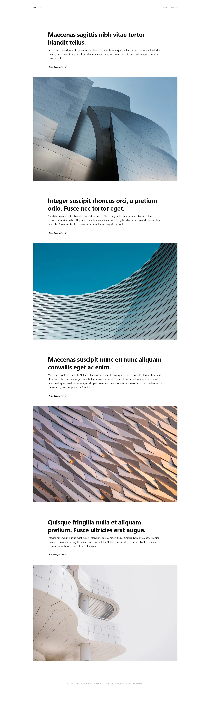
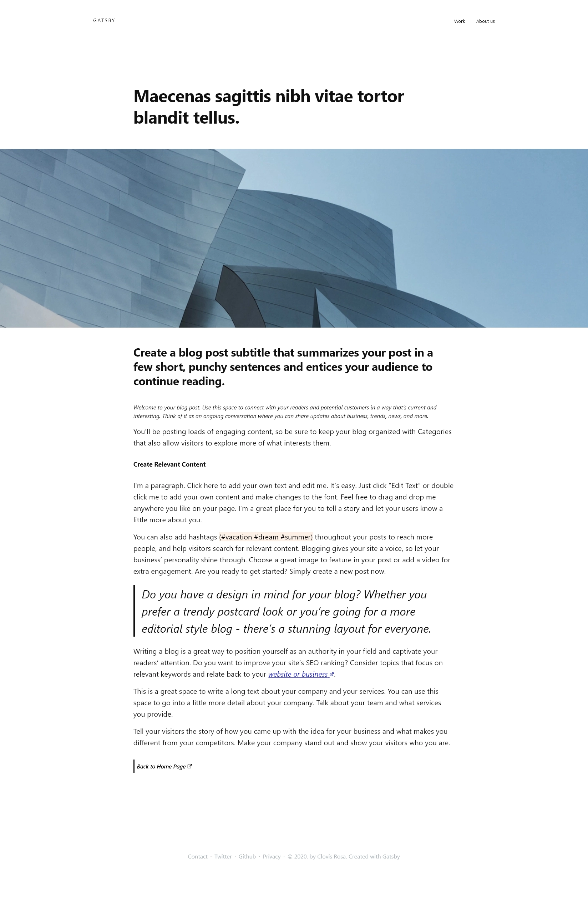
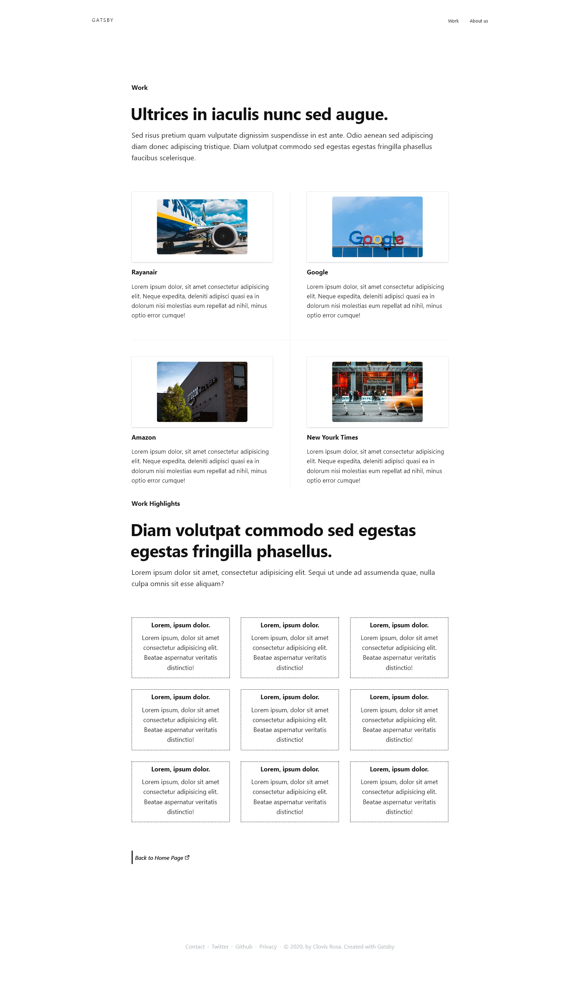
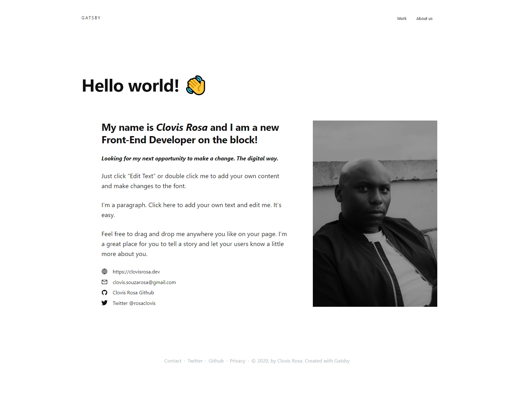

# [Gatsby/Framer-Motion/SCSS] Stunning Theme - Responsve Gatsby Website

> Stunning good looking minimal website just using system font and great looking images.

Website deployed at Vercel.com - [** Stunning Theme - https://stunning-gatsby-theme.vercel.app/**](https://stunning-gatsby-theme.vercel.app/)

---

## 🚀 Quick start

1.  **Clone this repo or simple download it.**

    Clone the master branch of this repo:

    ```shell
    # clone master repo
    git clone -b https://github.com/clovis-rosa/stunning-gatsby-theme.git
    ```

2.  **Start developing.**

    Navigate into your new site’s directory and start it up.

    ```shell
    # navigate to the project folder
    cd stunning-gatsby-theme/
    ```

    Install the dependencies

    ```shell
    yarn install
    # or
    npm install
    ```

    Open the source code and start editing!

    ```shell
    code .
    gatsby develop
    ```

    Your site is now running at `http://localhost:8000`!

## 🧐 What's inside?

A quick look at the dependencies amd resources:

- Bootstrapped with [Gatsby](www.gatsbyjs.com).
- Page transition and animations by [Framer-Motion](https://www.framer.com/motion/)
- Styled with [Node-SASS](https://github.com/sass/node-sass)

Others resources:

- MDN - [The clamp() CSS function](https://developer.mozilla.org/en-US/docs/Web/CSS/clamp)
- Responsive Web Design [Media Queries](https://responsivedesign.is/develop/browser-feature-support/media-queries-for-common-device-breakpoints/)
- Images from [Unsplash.com](https://unsplash.com/)

## 🎓 Learning Gatsby

Looking for more guidance? Full documentation for Gatsby lives [on the website](https://www.gatsbyjs.com/).

Here are some places to start:

### Themes

- To learn more about Gatsby themes specifically, we recommend checking out the [theme docs](https://www.gatsbyjs.com/docs/themes/).

## 💫 Deploying

- I recommend to use either [Zeit Now](https://now.sh) or [Netlify](https://netlify.com) for hosting your site.

---

Screenshots:





---

## 📖 License

- This project is licensed under [the terms of the 0BSD license](LICENSE).

### resources:

- https://image-processing.gatsbyjs.org/
- https://apex.sh/
- https://foundation.mozilla.org/en/blog/how-create-stronger-safer-online-communities/
